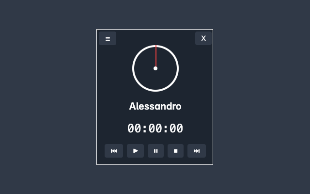
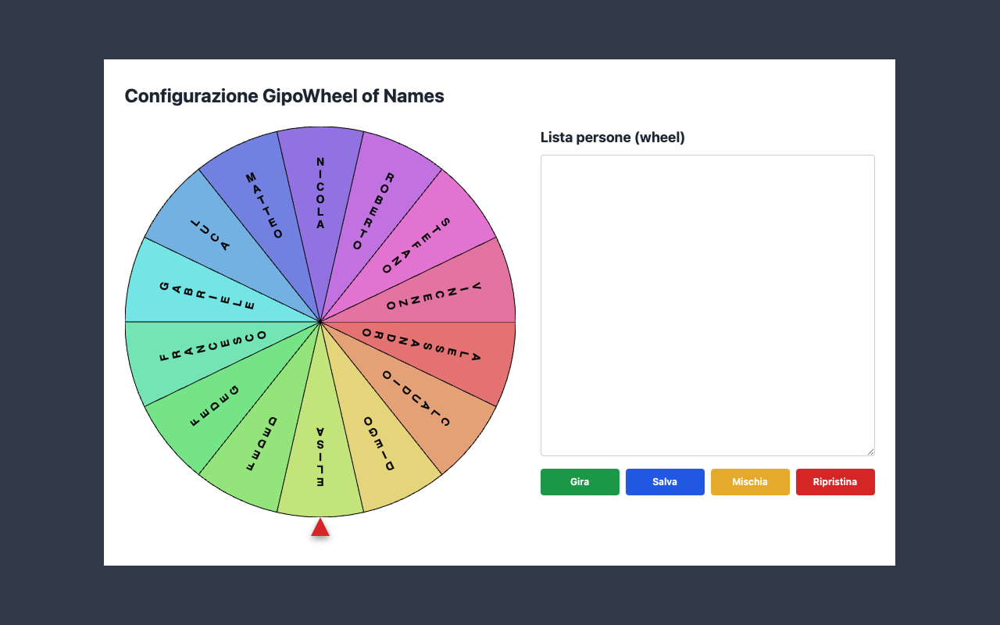

# GipoUtils – Chrome Extension

**GipoUtils** è un'estensione per Chrome che include due strumenti interattivi e configurabili:

- ⏱️ **GipoTimer** – Un timer associato a una lista di persone per gestire turni, attività o presentazioni.
- 🎡 **GipoWheel of Names** – Una ruota personalizzabile per scegliere nomi a caso.

---

## 🧩 Funzionalità principali

### GipoTimer

- Imposta un timer personalizzato per ogni partecipante
- Naviga avanti/indietro tra le persone
- Timer visivo con animazione tipo orologio analogico
- Comandi per avviare, fermare e resettare
- Tema chiaro/scuro selezionabile

### GipoWheel of Names

- Inserisci una lista di nomi (una per riga)
- Avvia l'animazione della ruota e seleziona un vincitore
- Effetti visivi con coriandoli 🎉
- Funzioni per mischiare e ripristinare la lista
- Elimina automaticamente i nomi già estratti

---

## ⚙️ Configurazione

Puoi configurare facilmente:

- Lista di nomi per la ruota
- Durata del timer (in secondi)
- Tema dell’interfaccia

Tutto viene salvato automaticamente tramite `chrome.storage.sync`.

---

## 🚀 Installazione (build prod)

1. Clona o scarica questa repository.
2. Installa le dipendenze: `npm install`.
3. Esegui la build: `npm run build`.
4. Apri `chrome://extensions/` nel browser.
5. Attiva la **Modalità sviluppatore** in alto a destra.
6. Clicca su **Carica estensione non pacchettizzata** e seleziona la cartella `dist`.

---

## 📁 Struttura dei file (post‑refactor React)

- `vite.config.js` – Configurazione Vite multipagina (popup, options, content)
- `manifest.json` – Configurazione estensione (punti a `popup/index.html`, `options/index.html`, `content.js`)
- `src/popup/*` – Popup in React
- `src/options/*` – Pagina Opzioni in React (Timer, Wheel, Changelog)
- `src/content/*` – Widget Timer in React come content script
- `assets/` – Icone, suoni e fogli di stile (Tailwind)
- `scripts/copy-to-dist.js` – Copia asset e riallinea gli HTML generati da Vite sotto `dist/`
- `dist/` – Output di build pronto per Chrome (generato da `npm run build`)

Nota: i vecchi file vanilla (`popup/*`, `options/*`, `content.js`) sono stati rimossi in favore della nuova struttura `src/*` con React.

## 🛠️ Sviluppo

- Build completa: `npm run build`
- Solo CSS (Tailwind): `npm run build:css`
- Solo Vite: `npm run build:vite`

Carica sempre l’estensione dalla cartella `dist` dopo la build.

---

## 🧪 Compatibilità

Testata su:

- Chrome (ultima versione)
- Chromium-based browsers (es. Edge)

---

# Norme sulla privacy

Questa estensione non raccoglie, memorizza né trasmette alcun dato personale. Tutti i dati inseriti dall’utente (es. nomi o impostazioni) vengono salvati localmente nel browser, e non vengono condivisi con terze parti.
